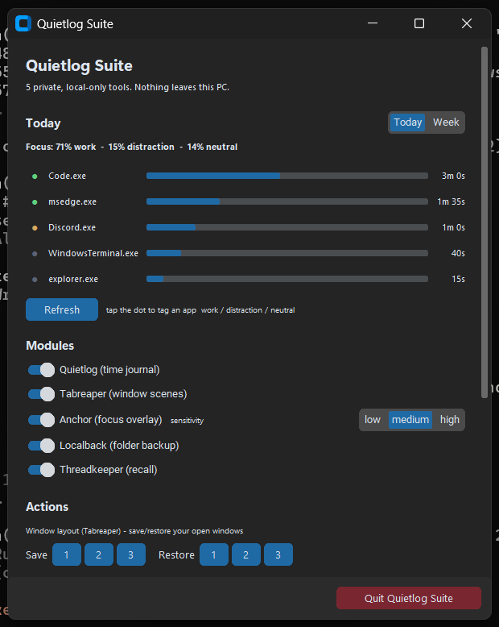
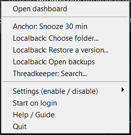

# Quietlog Suite

**Five private, local-first desktop tools in one Windows tray app.** Time tracking,
window-layout snapshots, a focus nudge, automatic file backup, and searchable recall —
all in a single dark dashboard. Nothing leaves your machine: no cloud, no account, no
subscription, **zero network calls**.



---

## Why it exists

Most tools that do these jobs are cloud SaaS — they upload your activity, your files,
or your screen, and bill you monthly. Quietlog does the same jobs **entirely on your own
PC**, using OS-level APIs a browser tab simply can't reach. One small `.exe`, owned by
you, working offline.

---

## The five modules

Each toggles on/off from the dashboard or the tray menu; state is saved to
`settings.json`. Three start **off** (opt-in) because they record or draw on screen.

| Module | What it does | Default |
|---|---|---|
| **Quietlog** | Passive time journal — samples the foreground app every 5s (idle excluded) and shows a **Today / This week** breakdown per app. | on |
| **Tabreaper** | Saves your window layout to 3 slots and restores it with one click — stop rebuilding your workspace on every context switch. | on |
| **Anchor** | Detects compulsive window-flipping and fades in a calm full-screen overlay; click to continue. Low/medium/high sensitivity + 30-min snooze. | off |
| **Localback** | Watches a folder and auto-versions every change (content-addressed dedup, keeps 25 newest per file). Restore any past version in-app. | off |
| **Threadkeeper** | Records window titles (and, opt-in, clipboard text) into a local full-text index so you can search *"what did that error say an hour ago?"* | off |

---

## Install & run

**Option A — grab the exe** (no Python needed): download `Quietlog.exe` from
[Releases](../../releases), double-click it. On first launch it opens a guide, drops a
tray icon, and enables run-on-startup.

**Option B — from source:**
```bash
pip install -r requirements.txt
python quietlog.py
```

The tray icon sits bottom-right (maybe under the `^` chevron). It is **colored** while a
recording module is active, **grey** when none are. Right-click it for the dashboard,
quick actions, settings, help, and quit:



The **Settings (enable / disable)** submenu toggles each module (and clipboard capture)
without opening the dashboard.

---

## The dashboard

One scrollable window (customtkinter, dark theme, Win11-native fonts) with:

- **Today / This week** — time-per-app bars, aligned, switchable
- **Modules** — on/off switches; Anchor gets an inline sensitivity selector
- **Actions** — window-layout save/restore (slots 1–3), choose/restore backup, search recall, help. Restores are confirm-gated; actions for a disabled module prompt you to enable it first.
- **Privacy / Data** — one-click wipe of usage history or recall history (confirm-gated)
- **Status** — autostart, clipboard-capture state, backup folder, version, data location
- **Quit** — always-visible footer button

---

## How to stop it

- **Now:** dashboard → *Quit Quietlog Suite*, or tray → *Quit*.
- **Stop auto-start:** tray → uncheck *Start on login* (or Task Manager → Startup).
- **Force:** `taskkill /F /IM Quietlog.exe`

---

## Privacy & data

All data lives under `%LOCALAPPDATA%\Quietlog\`:

| File / folder | Contents |
|---|---|
| `quietlog.db` | time samples + recall index (SQLite, WAL) |
| `settings.json` | which modules are on, watched folder, Anchor settings |
| `scenes.json` | saved window layouts |
| `localback\` | file version snapshots (readable date-stamped names) |

- History older than **90 days** is auto-deleted; Localback keeps the **25 newest**
  versions per file. Both are wipeable from the dashboard's Privacy / Data section.
- Threadkeeper stores window **titles** by default. Saving **clipboard** text is a
  separate opt-in (it can capture passwords) — off unless you enable it.
- Restoring a backup preserves the current file first, so a restore is itself undoable.

---

## Build a standalone .exe

```bash
pip install pyinstaller
pyinstaller --onefile --noconsole --name Quietlog \
  --hidden-import pystray._win32 --collect-all customtkinter quietlog.py
```
Both flags are **required**: pystray loads its tray backend dynamically (without the
hidden-import the icon never appears), and customtkinter's theme assets must be bundled.

Self-check the logic (no GUI, no network):
```bash
python quietlog.py --selftest
```
Covers: aggregation (today/week), retention prune, single-instance lock, autostart,
atomic settings save, window matching, backup dedup/prune/scan-skip, restore
round-trip + preserve, Anchor thresholds, and full-text search.

---

## Architecture notes

- **One GUI thread.** customtkinter keeps global window state that races across threads,
  so every window (dashboard, overlay, search, restore, folder picker) is built on a
  single dedicated GUI thread via a thread-safe queue.
- **Robust recorders.** Each background module runs with its own stop-event (clean
  start/stop, no thread leaks); loop bodies are exception-guarded so one bad cycle can't
  kill recording. SQLite uses WAL + a busy timeout for safe concurrent access.
- **Safe writes.** `settings.json` / `scenes.json` are written atomically (temp + replace).
- **Stack:** Python 3, `pywin32`, `pystray`, `Pillow`, `psutil`, `customtkinter`; SQLite,
  ctypes, winreg, tkinter from the stdlib.

---

## Not yet (possible v2)

Tabreaper relaunching *closed* apps (currently repositions open ones); full
visible-window-text capture for Threadkeeper (would add a dependency); per-app
work/distraction tagging for Quietlog.

---

*Windows only. Built as a learning project — a real, owned, offline alternative to a
shelf of cloud subscriptions.*
